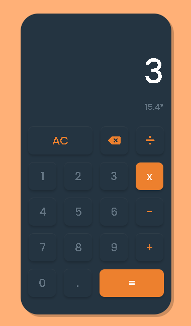
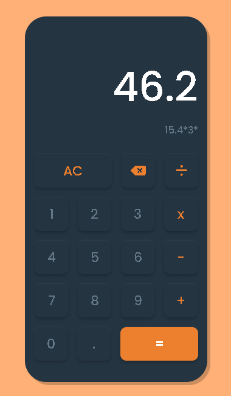

# Calculator

### Technologies Used

- HTML5
- CSS
- JavaScript

### Outcome
- Basic mathematical operations.
- Chain calculating and displaying it.
- Visually pleasing design.

### <a href="https://markewycz.github.io/calculator/">Live demo</a> 👈

### Screenshots
  

  
  
  

